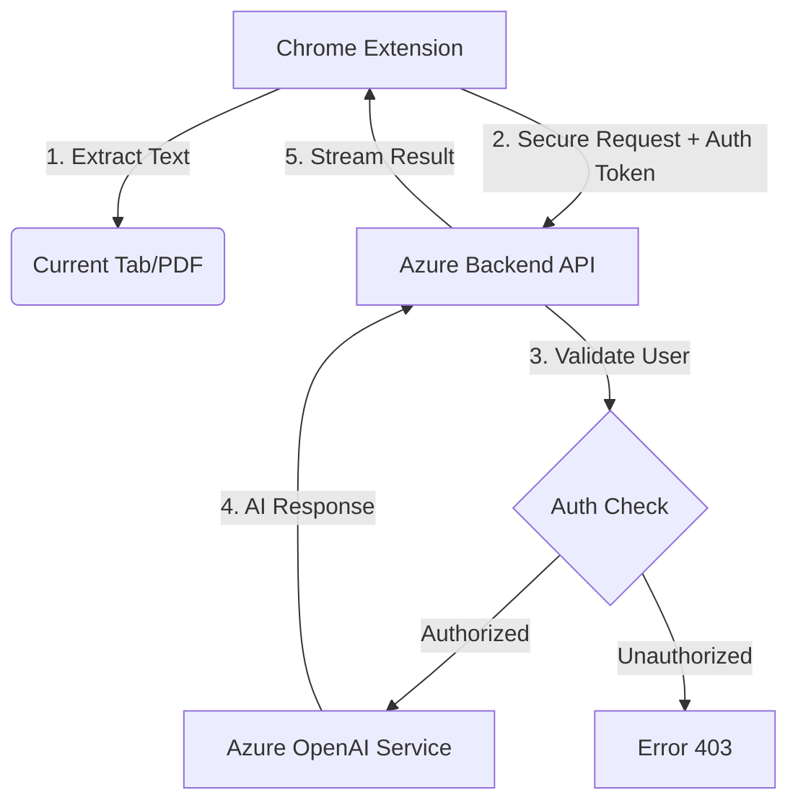

# 🎓 VU Education Lab AI Assistant for Teachers

<div align="center">

[](https://github.com/VU-Amsterdam/AI-Assistant)
[](LICENSE)
[](https://azure.microsoft.com/en-us/products/ai-services/openai-service/)

**Transform any webpage or PDF into valuable educational content with AI-powered analysis**

*Developed by Vrije Universiteit Amsterdam Education Lab*

[📥 Installation](#installation) • [🚀 Quick Start](#quick-start) • [📖 User Guide](#detailed-user-guide) • [🔐 Security](#security-features)

</div>

---

## 🌟 Overview

The VU Education Lab AI Assistant is a powerful Chrome extension designed exclusively for VU Amsterdam educators. It seamlessly converts web content and PDFs into pedagogically sound teaching materials using advanced AI technology via a secure backend.

**Perfect for:** Course preparation, lesson planning, quiz creation, content simplification, and discovering teaching opportunities in online resources.

---

## ✨ Key Features

### 🤖 Enterprise-Grade AI
- **Powered by Azure OpenAI** - Secure, fast, and reliable content generation.
- **Privacy First** - Data is processed securely without training the models.

### 📚 Educational Tools

| Tool | Purpose | Best For |
|------|---------|----------|
| 📝 **Summarize** | Condense web/PDF content | Quick overviews, lecture prep, study guides |
| ❓ **Quiz** | Generate assessments | Student engagement, knowledge checks, exams |
| 💡 **Explain** | Simplify complex concepts | Different learning levels, clarity, analogies |
| 🎓 **Teaching** | Get practical activity ideas | Lesson planning, classroom activities, essays |
| ⚡ **Custom** | Ask anything specific | Tailored analysis, specific teaching needs |

### 🚀 Smart Accessibility
- **Floating Quick-Access Icon** - An unobtrusive floating icon appears on educational pages for instant access.
- **PDF Support** - Native support for analyzing PDF files directly in the browser.
- **Draggable Interface** - Move the extension window anywhere on your screen.

### 🌐 Multilingual Support
- **Interface Languages:** English and Dutch (Nederlands)
- **AI Output:** Automatically responds in your selected interface language
- **Language Toggle:** Quick switch with EN/NL button

### 🔒 Enterprise Security
- **Google OAuth Authentication** - Secure sign-in with VU accounts.
- **Domain Restrictions** - Exclusive access for `@vu.nl` and `@student.vu.nl` emails.
- **Zero Data Storage** - Content is processed in real-time; no page content is stored on servers.

---

## 📥 Installation

### Step 1: Download Extension

1. Clone or download this repository.
2. Navigate to the `chrome-extension` folder.

### Step 2: Load in Browser

1. Open Chrome, Brave, or Edge browser.
2. Navigate to `chrome://extensions/` (or `brave://extensions/`).
3. Enable **Developer mode** (toggle in top-right corner).
4. Click **"Load unpacked"**.
5. Select the `chrome-extension` folder.
6. The extension icon should appear in your toolbar.

### Step 3: Authentication

1. Click the extension icon.
2. Click **"Sign in with Google"**.
3. Use your **VU email address** (`@vu.nl` or `@student.vu.nl`).
   * *Note: Personal Gmail accounts are not authorized.*

---

## 🚀 Quick Start

### First-Time Use

1. **Navigate** to any educational webpage or open a PDF in Chrome.
2. **Open Extension** by clicking the toolbar icon or the floating VU logo (on supported pages).
3. **Choose a Tool** (e.g., Summarize, Quiz).
4. **Configure Options** (e.g., "Medium" length).
5. **Click "Generate"**.
6. **Copy** the result to your clipboard.

### Example Workflow: Creating a Quiz

**Scenario:** You are viewing a research article on Climate Change.

1. Open the **Quiz** tab.
2. Select **Multiple Choice**.
3. Set Difficulty to **University**.
4. Choose **5 Questions**.
5. Click **Generate**.
6. Review the questions, answers, and explanations.
7. Click **Copy** to paste them into Canvas or your slides.

---

## 📖 Detailed User Guide

### 📝 Summarize Tool
Create concise summaries tailored for educational contexts.
- **Options:** Short (overview), Medium (balanced), Long (comprehensive).
- **Output:** Includes executive summary, learning objectives, core content, and discussion questions.

### ❓ Quiz Tool
Generate ready-to-use assessment questions with full explanations.
- **Types:** Multiple Choice, True/False, Short Answer, Mixed.
- **Features:** Includes correct answers, detailed explanations, and common misconceptions for each question.

### 💡 Explain Tool
Simplify complex topics for different student levels.
- **Levels:** Beginner, Intermediate, Advanced.
- **Modes:**
  - **General:** Explains the main concepts of the page.
  - **Specific Topic:** Enter a specific term (e.g., "Quantum Entanglement") to get a targeted explanation based on the text.

### 🎓 Teaching Suggestions Tool
Get practical pedagogical ideas based on the content.
- **Formats:**
  - **Lecture:** Talking points and presentation structure.
  - **Discussion:** Debate topics and seminar prompts.
  - **Activity:** Hands-on group work and exercises.
  - **Assessment:** Rubrics and testing strategies.
  - **Essay:** Essay prompts with grading criteria.

### ⚡ Custom Prompt Tool
Ask specific questions or use pre-built educational templates.
- **Templates:** Main Arguments, Concept Map, Student Implications, Bias Analysis, Reflection Questions.
- **Custom:** Type any instruction (e.g., "Create a glossary of terms from this text").

---

## ⚙️ Settings & Configuration

Access settings by clicking the ⚙️ gear icon.

- **Language:** Toggle between English and Dutch.
- **Floating Popup:** Enable/Disable the floating VU logo on web pages.
- **Account:** View your signed-in user profile or sign out.
- **Backend Status:** Check your connection to the secure VU AI backend.

---

## 🔒 Security & Privacy

### Authentication
- Uses **Google OAuth 2.0** for secure sign-in.
- Strictly enforces **VU domain validation**.

### Data Handling
- **No Content Storage:** Webpage text is sent to the backend solely for processing and is immediately discarded.
- **Secure Transmission:** All data is encrypted in transit (HTTPS).
- **API Keys:** Managed securely on the server; never exposed to the client.

### Permissions Explained
- `activeTab`: To read the text of the page you are analyzing.
- `identity`: For Google Sign-In.
- `storage`: To save your preferences (language, settings).
- `scripting`: To inject the floating icon and extraction logic.

---

## 🔧 Technical Details

### Architecture



### File Structure

```
chrome-extension/
├── manifest.json           # Extension configuration (V3)
├── popup.html/js           # Main UI logic
├── content.js/css          # Page text & PDF extraction
├── background.js           # Service worker & OAuth handling
├── api.js                  # Backend communication (Streaming)
├── auth.js                 # Authentication logic
├── settings.html/js        # User preferences
├── iframe-bridge.js        # Draggable window communication
├── locales/                # i18n JSON files (en, nl)
└── images/                 # Icons and assets
```

---

## ⚠️ Troubleshooting

**"Backend Connection Failed"**
- Ensure you have an active internet connection.
- The backend server might be sleeping (cold start); try again in 30 seconds.

**"Sign in with Google" not working**
- Ensure you are not blocking third-party cookies for Google accounts.
- Check if your browser prevents pop-ups.

**PDF Analysis Issues**
- Ensure the PDF contains selectable text (scanned images cannot be read).
- Try reloading the PDF page.

---

## 📄 License

GPL-3.0 License - Copyright © 2025 VU Amsterdam Education Lab

---

<div align="center">

**Empowering educators with responsible AI tools**

[🌐 Visit VU Education Lab](https://vu.nl/onderwijswerkplaats)

</div>
