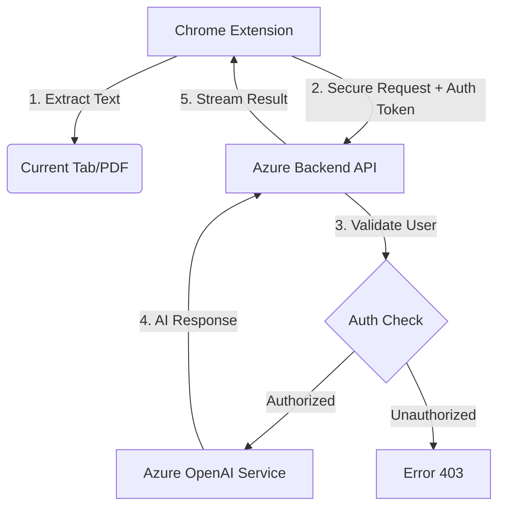

# 🎓 VU Education Lab AI Assistant for Teachers

<div align="center">

[](https://github.com/VU-Amsterdam/AI-Assistant)
[](#project-status)
[](LICENSE)
[](https://azure.microsoft.com/en-us/products/ai-services/openai-service/)

**Transform any webpage or PDF into valuable educational content with AI-powered analysis**

*A pilot project by [VU Centre for Teaching and Learning (CTL)](https://vu.nl/onderwijswerkplaats)*

[📥 Installation](#installation) • [🚀 Quick Start](#quick-start) • [📖 Tools](#tool-details) • [🔐 Privacy](#privacy--security) • [❓ FAQ](#faq)

</div>

---

## 📋 Project Status

> **Pilot Phase:** This tool is currently a pilot project by the VU Centre for Teaching and Learning (CTL). It is available for VU staff to explore and provide feedback during the pilot phase.

---

## 🌟 Overview

A Chrome extension that converts web content and PDFs into teaching materials using Azure OpenAI.

**Perfect for:** Course prep, lesson planning, quiz creation, and content simplification.

---

## ✨ Key Features

| Tool | Purpose |
|------|---------|
| 📝 **Summarize** | Condense content into overviews, learning objectives, discussion questions |
| ❓ **Quiz** | Generate multiple choice, true/false, or short answer questions |
| 💡 **Explain** | Simplify concepts at beginner, intermediate, or advanced levels |
| 🎓 **Teaching** | Get ideas for lectures, discussions, activities, assessments |
| ⚡ **Custom** | Ask specific questions or use educational templates |

**Also includes:**
- 🌐 English & Dutch interface with automatic AI language matching
- 📄 PDF support directly in browser
- 🔘 Floating quick-access icon on webpages
- 🔒 Secure Google OAuth (`@vu.nl` only) · GDPR compliant · No data storage

---

## 📥 Installation

### Step 1: Download Extension

1. Clone or download this repository.
2. Navigate to the `chrome-extension` folder.

### Step 2: Load in Browser

1. Open Chrome, Brave, or Edge browser.
2. Navigate to `chrome://extensions/` (or `brave://extensions/`).
3. Enable **Developer mode** (toggle in top-right corner).
4. Click **"Load unpacked"**.
5. Select the `chrome-extension` folder.
6. The extension icon should appear in your toolbar.

### Step 3: Authentication

1. Click the extension icon.
2. Click **"Sign in with Google"**.
3. Use your **VU staff email address** (`@vu.nl`).
   * *Note: Personal Gmail accounts are not authorized. During the pilot phase, access is limited to VU staff.*

---

## 🚀 Quick Start

1. Navigate to any webpage or PDF
2. Click the extension icon (or floating VU logo)
3. Choose a tool → Configure options → Click **Generate**
4. Copy the result to Canvas, slides, or documents

**Example:** On a Climate Change article → Quiz tab → Multiple Choice → University level → 5 Questions → Generate → Copy to Canvas

---

## 📖 Tool Details

| Tool | Options | Output |
|------|---------|--------|
| **Summarize** | Short / Medium / Long | Executive summary, learning objectives, discussion questions |
| **Quiz** | MC / True-False / Short Answer / Mixed | Questions with answers, explanations, common misconceptions |
| **Explain** | Beginner / Intermediate / Advanced | Concept explanations (general or specific term) |
| **Teaching** | Lecture / Discussion / Activity / Assessment / Essay | Format-specific pedagogical ideas |
| **Custom** | Templates or free-form | Tailored analysis based on your prompt |

---

## ⚙️ Settings

Click the ⚙️ gear icon to configure language (EN/NL), floating popup visibility, account, and backend status.

---

## 🔒 Privacy & Security

**Authentication:** Google OAuth 2.0 with VU domain validation (`@vu.nl` only)

**Data Handling:**
- No content storage — text processed and immediately discarded
- All data encrypted in transit (HTTPS)
- API keys secured server-side

**VU Agreements:**
- **Azure OpenAI:** Data not used for model training, processed in EU, GDPR compliant
- **Google Cloud:** Authentication data not shared with third parties

**Permissions:** `activeTab` (read page), `identity` (sign-in), `storage` (preferences), `scripting` (floating icon)

---

## 🔧 Technical Details

### Architecture



### File Structure

```
chrome-extension/
├── manifest.json           # Extension configuration (V3)
├── popup.html/js           # Main UI logic
├── content.js/css          # Page text & PDF extraction
├── background.js           # Service worker & OAuth handling
├── api.js                  # Backend communication (Streaming)
├── auth.js                 # Authentication logic
├── settings.html/js        # User preferences
├── iframe-bridge.js        # Draggable window communication
├── locales/                # i18n JSON files (en, nl)
└── images/                 # Icons and assets
```

---

## 💡 Example Workflows

| Scenario | Workflow |
|----------|----------|
| **Wikipedia → Lecture** | Summarize for overview → Quiz for assessment → Teaching for activities |
| **News Article → Quiz** | Open article → Quiz tool → Copy questions to Canvas/slides |
| **Academic Paper → Student Handout** | Explain at Beginner/Advanced level → Enter specific terms for targeted explanations |
| **Lecture Prep** | Summarize 2-3 resources → Teaching (Lecture format) for talking points |

---

## ❓ FAQ

| Question | Answer |
|----------|--------|
| **Why use this over ChatGPT?** | Enterprise-grade Azure OpenAI, GDPR compliant, data not used for training |
| **Supported browsers?** | Chrome, Brave, Edge (not Firefox) |
| **Why is it slow sometimes?** | Backend cold start — retry in 30 seconds |
| **Works on any website?** | Yes, any site with readable text (news, Wikipedia, journals, etc.) |

---

## ⚠️ Troubleshooting

| Issue | Solution |
|-------|----------|
| **Backend Connection Failed** | Check your internet connection. The backend may need a cold start—try again in 30 seconds. |
| **Sign in with Google not working** | Ensure third-party cookies are not blocked for Google. Check if your browser prevents pop-ups. |
| **PDF Analysis Issues** | Ensure the PDF contains selectable text (scanned images cannot be read). Try reloading the PDF page. |

---

## 📞 Support

- **Email:** [onderwijswerkplaats@vu.nl](mailto:onderwijswerkplaats@vu.nl)
- **Faculty Support:** [Find your contact](https://canvas.vu.nl/courses/47759/pages/faculty-contact-persons)
- **Free 1-on-1 Session:** [Book an appointment](https://docs.google.com/forms/d/e/1FAIpQLSfG6moeKRtdNNupzoaItMo6cpBaxL_HX8t78JLmnMj-krqe6Q/viewform)
- **Share Feedback:** [Contact form](https://docs.google.com/forms/d/e/1FAIpQLSfT6t6L0xLO5rim8H8X-pRDg2phTYTmdS7IvSvDcOXdiWeaUA/viewform?usp=sf_link)

---

## 📄 License

GPL-3.0 License — © 2025 VU Amsterdam Education Lab — [Open Source](https://github.com/VU-Amsterdam/AI-Assistant)

---

<div align="center">

**Empowering educators with responsible AI tools**

[🌐 VU Education Lab](https://vu.nl/onderwijswerkplaats) • [📚 Teaching at VU Amsterdam](https://vu.nl/en/employee/teaching-at-vu-amsterdam) • [📖 AI Literacy Companion](https://assets-us-01.kc-usercontent.com/d8b6f1f5-816c-005b-1dc1-e363dd7ce9a5/da303a9b-c2bd-4d32-98a8-490e040c91f1/AI%20Literacy%20Companion%20v1.1%20US%20-%20Student%20-%20v5%20Oct%202025.pdf)

</div>
